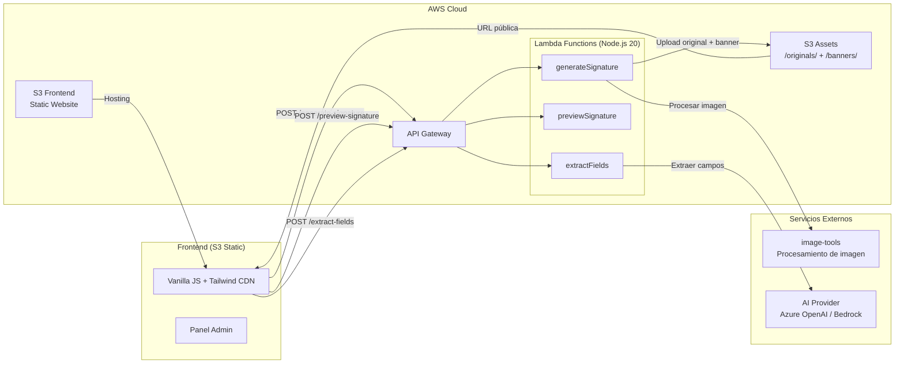

# Email Signature Generator & Asset CDN

Aplicación web self-service para generar firmas de correo corporativas. El usuario sube su foto, llena sus datos (manual o con IA), selecciona una plantilla y obtiene su firma HTML lista para copiar.

## Arquitectura



### Flujo de datos

1. **Flujo manual:** Usuario llena formulario → sube foto → `POST /generate-signature` → Lambda sube imagen a S3 → invoca image-tools para banner → renderiza template Mustache → retorna HTML
2. **Flujo IA:** Usuario pega texto libre → `POST /extract-fields` → Lambda envía a AI Provider → retorna campos extraídos → pre-llena formulario
3. **Preview:** Usuario solicita vista previa → `POST /preview-signature` → renderiza template con placeholder → retorna HTML sin procesar imagen

## Quick Start (desarrollo local)

```bash
# 1. Instalar dependencias
cd lambda && npm install

# 2. Crear archivo de configuración
cp .env.example .env

# 3. Levantar servidor de desarrollo
npm run dev
# o desde la raíz:
cd .. && npm run dev
```

El servidor arranca en `http://localhost:3000` con modo local (no necesita AWS).

## Variables de entorno

| Variable | Requerida | Default | Descripción |
|----------|-----------|---------|-------------|
| `APP_MODE` | Sí | `local` | Modo de ejecución: `local` (mocks) o `aws` (producción) |
| `PORT` | No | `3000` | Puerto del servidor de desarrollo local |
| `S3_BUCKET_NAME` | Prod | — | Nombre del bucket S3 para assets |
| `AWS_REGION` | Prod | `us-east-1` | Región AWS |
| `IMAGE_TOOLS_URL` | Sí | — | URL del servicio de procesamiento de imagen |
| `IMAGE_TOOLS_API_KEY` | Sí | — | API key para image-tools |
| `BACKGROUND_TEMPLATE_URL` | No | — | URL del template de fondo por defecto |
| `AI_PROVIDER` | Sí | `bedrock` | Proveedor IA: `azure` o `bedrock` |
| `AZURE_OPENAI_ENDPOINT` | Azure | — | Endpoint de Azure OpenAI |
| `AZURE_OPENAI_KEY` | Azure | — | API key de Azure OpenAI |
| `AZURE_OPENAI_DEPLOYMENT` | Azure | — | Nombre del deployment (ej: `gpt-4o-mini`) |
| `BEDROCK_MODEL_ID` | Bedrock | `anthropic.claude-3-haiku-20240307-v1:0` | ID del modelo en Bedrock |
| `BEDROCK_REGION` | Bedrock | `us-east-1` | Región de Bedrock |
| `ADMIN_PASSWORD_HASH` | No | — | Hash SHA-256 del password de admin |

## Probar ahora

| Qué probar | Cómo |
|------------|------|
| Health check | `GET http://localhost:3000/health` |
| Listar plantillas | `GET http://localhost:3000/templates` |
| Preview de firma | `POST /preview-signature` con JSON (ver abajo) |
| Generar firma completa | `POST /generate-signature` con imagen base64 |
| Extracción IA | `POST /extract-fields` con texto libre |

### Ejemplo: Preview de firma

```bash
curl -X POST http://localhost:3000/preview-signature \
  -H "Content-Type: application/json" \
  -d '{"nombre":"Jonathan Arana","cargo":"Tech Lead","email":"jonathan@contoso.com","telefono":"+593996666193","templateId":"corporativa"}'
```

### Ejemplo: Extracción de campos con IA

```bash
curl -X POST http://localhost:3000/extract-fields \
  -H "Content-Type: application/json" \
  -d '{"text":"Jonathan Arana, jonathan@contoso.com, Tech Lead, +593996666193"}'
```

## Tests

```bash
cd lambda && npm test
```

70 tests unitarios cubriendo config, validación, template engine, storage, AI provider y Lambda handlers.

## Deployment (AWS SAM)

### Pre-requisitos

- AWS CLI configurado con credenciales
- AWS SAM CLI instalado (`pip install aws-sam-cli`)
- Node.js 20.x

### Pasos de despliegue

```bash
# 1. Build del proyecto
sam build

# 2. Deploy guiado (primera vez)
sam deploy --guided

# 3. Deploy posterior (usa samconfig.toml)
sam deploy

# 4. Subir frontend al bucket S3
aws s3 sync frontend/ s3://$(sam list stack-outputs --output json | jq -r '.[] | select(.OutputKey=="FrontendBucketName") | .OutputValue')/ --delete
```

### Parámetros de SAM

| Parámetro | Descripción |
|-----------|-------------|
| `ImageToolsUrl` | URL del servicio image-tools |
| `AIProvider` | Proveedor IA (`azure` o `bedrock`) |

### Recursos creados

- **SignatureApi** — HTTP API Gateway con CORS
- **GenerateSignatureFunction** — Lambda para generar firma
- **PreviewSignatureFunction** — Lambda para preview
- **ExtractFieldsFunction** — Lambda para extracción IA
- **AssetsBucket** — S3 con acceso público para imágenes
- **FrontendBucket** — S3 con hosting estático para el frontend

### Outputs

| Output | Descripción |
|--------|-------------|
| `ApiUrl` | URL base de la API (API Gateway) |
| `FrontendUrl` | URL del sitio web estático |
| `AssetsBucketName` | Nombre del bucket de assets |

## Estructura del proyecto

```
/
├── frontend/              # UI estática (Vanilla JS + Tailwind CDN)
│   ├── index.html         # Página principal (formulario + preview + AI)
│   ├── admin.html         # Panel admin (validador de templates)
│   ├── css/styles.css     # Estilos custom (spinner, status, iframes)
│   └── js/
│       ├── api.js         # Cliente fetch para todos los endpoints
│       ├── app.js         # Lógica principal: form, AI extract, generate, copy
│       ├── auth.js        # Autenticación admin (SHA-256)
│       ├── fieldConfig.js # Configuración centralizada de campos
│       ├── preview.js     # Renderizado en iframe con auto-height
│       └── validator.js   # Validador de templates (8 reglas)
├── lambda/                # Backend Node.js (Lambda handlers + dev server)
│   ├── src/
│   │   ├── handlers/      # Lambda handlers (generateSignature, preview, extract)
│   │   ├── services/      # Template engine, storage, image-tools client
│   │   ├── providers/     # AI providers (Azure OpenAI, Bedrock)
│   │   └── utils/         # Config, validation
│   ├── tests/unit/        # Jest unit tests (70 tests)
│   ├── local-storage/     # Imágenes generadas en dev (gitignored)
│   └── dev-server.js      # Servidor Express para desarrollo local
├── templates/             # Plantillas Mustache (3 variantes)
│   ├── corporativa.mustache
│   ├── moderna-banner.mustache
│   └── minimalista.mustache
├── docs/                  # Documentación extendida
├── template.yaml          # SAM template (infraestructura AWS)
└── .kiro/specs/           # Spec del proyecto (requirements, design, tasks)
```

## Tecnologías

- **Frontend:** HTML/JS vanilla + Tailwind CDN
- **Backend:** Node.js 20, Express (dev) / AWS Lambda (prod)
- **Templates:** Mustache (3 diseños: corporativa, moderna-banner, minimalista)
- **AI:** Azure OpenAI / AWS Bedrock (patrón provider intercambiable)
- **Storage:** Local filesystem (dev) / AWS S3 (prod)
- **Imágenes:** image-tools con 3 presets de composición (centrado, inferior, avanzado)
- **Infra:** AWS SAM (Lambda + API Gateway + S3)
- **Tests:** Jest (70 tests unitarios)

## Documentación

Ver `docs/` para:
- [Arquitectura](docs/architecture.md)
- [API Reference](docs/api-reference.md)
- [Desarrollo local](docs/local-development.md)

## Estado del proyecto

| Fase | Estado |
|------|--------|
| 1. Estructura y utilidades | ✅ Completo |
| 2. Templates y engine | ✅ Completo |
| 3. Storage e image-tools | ✅ Completo |
| 4. AI provider abstraction | ✅ Completo |
| 5. Lambda handlers | ✅ Completo |
| 6. Checkpoint (70 tests) | ✅ Completo |
| 7. Frontend | ✅ Completo |
| 8. Admin panel | ✅ Completo |
| 9. Checkpoint frontend | ✅ Completo |
| 9.5 Image composition params | ✅ Completo |
| 10. Infra y docs finales | ✅ Completo |

**Funcionalidades operativas:**
- Formulario con todos los campos + selector de plantilla + subida de imagen
- Extracción de campos con IA (Azure OpenAI / Bedrock) que pre-llena el formulario
- Vista previa instantánea (muestra la imagen seleccionada sin esperar procesamiento)
- Generación completa de firma con procesamiento de banner via image-tools
- 3 presets de composición de imagen (centrado, inferior, avanzado con params custom)
- Fondo personalizado: el usuario puede subir su propio fondo o usar el default
- Validación de imagen: máximo 15MB, solo PNG/JPG/WebP
- Copiar HTML al clipboard / Descargar HTML / Abrir en nueva ventana
- 3 plantillas: Corporativa, Moderna con Banner, Minimalista
- Panel admin con autenticación SHA-256 y validador de templates (8 reglas)
- Infraestructura reproducible con AWS SAM

## Demo Script (3 minutos)

Guión para demostración en video de las funcionalidades principales.

### Minuto 0:00–1:00 — Flujo Manual

1. **Abrir la app** en `http://localhost:3000` (o URL de producción)
2. **Llenar el formulario** manualmente:
   - Nombre: "María López"
   - Cargo: "Directora de Marketing"
   - Email: "maria.lopez@empresa.com"
   - Teléfono: "+593 99 123 4567"
   - LinkedIn: "linkedin.com/in/marialopez"
3. **Seleccionar plantilla** "Corporativa"
4. **Subir foto** de perfil (mostrar validación: solo PNG/JPG/WebP, máx 15MB)
5. **Seleccionar preset** de composición "Centrado"
6. **Click en "Vista Previa"** → mostrar el preview instantáneo en iframe
7. **Click en "Generar Firma"** → esperar procesamiento → mostrar resultado final
8. **Demostrar acciones:** Copiar HTML, Descargar archivo, Abrir en nueva ventana

### Minuto 1:00–2:00 — Flujo con IA

1. **Click en la pestaña "Extraer con IA"**
2. **Pegar texto libre:**
   > "Soy Jonathan Arana, trabajo como Tech Lead en Contoso. Mi correo es jonathan@contoso.com y mi teléfono +593 99 666 6193. Mi perfil de LinkedIn es linkedin.com/in/jarana"
3. **Click en "Extraer Campos"** → mostrar loading → campos se pre-llenan automáticamente
4. **Mostrar feedback:** campos encontrados vs campos faltantes
5. **Editar un campo** manualmente (demostrar que es editable)
6. **Cambiar plantilla** a "Moderna con Banner"
7. **Subir foto** y seleccionar preset "Inferior"
8. **Generar firma** → mostrar resultado con diseño diferente

### Minuto 2:00–3:00 — Preview y Panel Admin

1. **Mostrar preview rápido** sin subir imagen (funciona sin foto)
2. **Cambiar entre las 3 plantillas** y mostrar preview de cada una
3. **Navegar al Panel Admin** (`/admin.html`)
4. **Login** con credenciales de admin
5. **Abrir el Validador de Templates**
6. **Pegar un template inválido** (con `<style>` block y sin `{{bannerUrl}}`)
7. **Ejecutar validación** → mostrar errores (ERROR: style block, ERROR: missing variable)
8. **Pegar un template válido** → mostrar resultado limpio (sin errores)
9. **Cierre:** mostrar la arquitectura serverless y mencionar los 70 tests pasando
