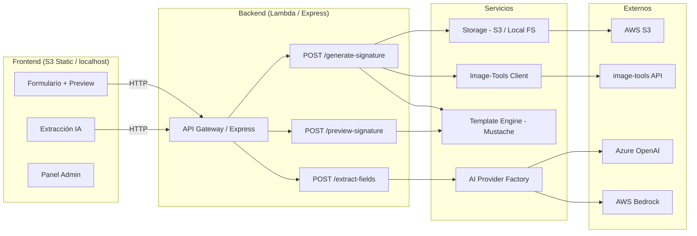

# Email Signature Generator

Aplicación web self-service para generar firmas de correo corporativas con IA. El usuario sube su foto, llena datos (manual o con IA), selecciona plantilla, personaliza el fondo y obtiene su firma HTML lista para copiar en Outlook o Gmail.

## Arquitectura



## Quick Start

```bash
# 1. Instalar dependencias
cd lambda && npm install

# 2. Configurar entorno
cd .. && cp .env.example .env

# 3. Levantar servidor
cd lambda && npm run dev
```

Abre `http://localhost:3005` — funciona sin AWS ni servicios externos.

## Scripts útiles

| Script | Comando | Descripción |
|--------|---------|-------------|
| Dev server | `cd lambda && npm run dev` | Servidor local en puerto 3005 (frontend + API) |
| Tests | `cd lambda && npm test` | Ejecuta 70 tests con coverage |
| Tests (watch) | `cd lambda && npm run test:watch` | Modo watch para desarrollo |
| Hash admin | `node scripts/generate-hash.js <password>` | Genera SHA-256 para panel admin |
| Diagnóstico Azure | `node scripts/diagnose-azure.js` | Prueba versiones de API de Azure OpenAI |
| Deploy AWS | `.\scripts\deploy_aws.ps1` | Despliegue automatizado a AWS (alternativa a `sam deploy`) |

## Funcionalidades

| # | Feature | Descripción |
|---|---------|-------------|
| 1 | Extracción con IA | Texto libre → campos del formulario (Azure OpenAI / Bedrock) |
| 2 | 3 plantillas | Corporativa (130×160px), Moderna-Banner (180×210px), Minimalista (56×56px) |
| 3 | Composición de imagen | 3 presets: centrado, inferior, avanzado (parámetros custom) |
| 4 | Fondo personalizado | Upload de fondo + recorte con Cropper.js (ratio por plantilla) |
| 5 | Recorte de foto | Recorte libre de foto de perfil (opcional) |
| 6 | Validación de imagen | Máx 15MB, solo PNG/JPG/WebP |
| 7 | Vista previa instantánea | Preview con imagen seleccionada sin esperar procesamiento |
| 8 | Generación con image-tools | Servicio externo + fallback local si no está disponible |
| 9 | Exportación múltiple | Copiar para Outlook (HTML), Copiar para Gmail, Descargar HTML, Abrir en ventana |
| 10 | Panel admin | Validador de templates (8 reglas: 4 errores, 4 warnings) |
| 11 | Autenticación admin | SHA-256 con hash configurable via env var |
| 12 | Datos de ejemplo | Botón para llenar formulario con datos de prueba |
| 13 | Feedback de fallback | Indica cuando image-tools no está disponible y se usó la imagen original |

## Límites y restricciones

| Límite | Valor | Dónde se aplica |
|--------|-------|-----------------|
| Tamaño máximo de imagen | 15MB decodificado | Upload de foto/fondo en base64 |
| Texto máximo para IA | 2000 caracteres | Endpoint `/extract-fields` |
| Formatos de imagen soportados | PNG, JPG, WebP | Validación en upload |
| Timeout Lambda (generate) | 60s | SAM template — procesamiento completo |
| Timeout Lambda (otros) | 30s | SAM template — preview y extract |
| Memoria Lambda (generate) | 512MB | SAM template — procesa imágenes |
| Memoria Lambda (otros) | 256MB | SAM template — operaciones simples |
| Body size máximo | 15MB | Dev server + API Gateway config |
| Templates disponibles | 5 (3 públicas + 2 privadas) | Ver sección Templates |

## Variables de entorno

| Variable | Default | Requerida | Descripción |
|----------|---------|-----------|-------------|
| `PORT` | `3005` | No | Puerto del dev server |
| `STORAGE_PROVIDER` | `local` | No | `local` (filesystem), `s3` o `azure` — define el almacenamiento |
| `S3_BUCKET_NAME` | — | Si s3 | Nombre del bucket S3 para assets |
| `AWS_REGION` | `us-east-1` | Si s3 | Región AWS |
| `AZURE_ACCOUNT_NAME` | — | Si azure | Nombre del storage account de Azure |
| `AZURE_ACCOUNT_KEY` | — | Si azure | Clave de acceso del storage account |
| `AZURE_CONTAINER_NAME` | — | Si azure | Container de Azure Storage |
| `IMAGE_TOOLS_URL` | — | Opcional | URL del servicio de procesamiento de imagen |
| `IMAGE_TOOLS_API_KEY` | — | Opcional | API key para image-tools |
| `BACKGROUND_TEMPLATE_URL` | — | Opcional | URL del fondo por defecto para banners |
| `AI_PROVIDER` | `azure` | Sí | `azure` o `bedrock` |
| `AZURE_OPENAI_ENDPOINT` | — | Si azure | Endpoint (antiguo `*.openai.azure.com` o nuevo `*/openai/v1`) |
| `AZURE_OPENAI_KEY` | — | Si azure | API key de Azure OpenAI |
| `AZURE_OPENAI_DEPLOYMENT` | `gpt-4o-mini` | Si azure | Deployment/modelo desplegado |
| `AZURE_OPENAI_API_STYLE` | `auto` | No | `auto`, `legacy` u `openai` (formato del endpoint) |
| `AZURE_OPENAI_API_VERSION` | `2024-10-21` | No | Versión de API de Azure OpenAI |
| `AZURE_OPENAI_API_TYPE` | `chat` | No | `chat` (Chat Completions) o `responses` (Responses API + stream) |
> **☁️ Storage: elige un solo proveedor.** Configura `STORAGE_PROVIDER` a `local`, `s3` o `azure` y completa únicamente el bloque correspondiente (S3 de AWS **o** Azure Storage). En `local`, las imágenes van a `lambda/local-storage/`.


| `BEDROCK_MODEL_ID` | `anthropic.claude-3-haiku-20240307-v1:0` | Si bedrock | ID del modelo |
| `BEDROCK_REGION` | `us-east-1` | Si bedrock | Región de Bedrock |
| `ADMIN_PASSWORD_HASH` | — | Opcional | Hash SHA-256 del password admin |
| `AZURE_OPENAI_DEBUG` | `false` | No | `true` para loguear URL/body del request a Azure (la key se enmascara) |
> **🤖 IA: elige un solo proveedor.** Configura `AI_PROVIDER` a `azure` o `bedrock` y completa únicamente el bloque correspondiente (Azure OpenAI **o** AWS Bedrock); no hace falta llenar ambos. Si el proveedor elegido no tiene credenciales, en modo local la extracción de campos usa un "mock" por regex (funciona sin IA). Más detalle en [`docs/local-development.md`](docs/local-development.md) → *"Configurar IA real en local"*.


Para generar el hash de admin:

```bash
node scripts/generate-hash.js miPasswordSeguro123
```

## Deployment (AWS SAM)

### Requisitos previos

1. **Cuenta AWS** — Free Tier es suficiente para pruebas (Lambda: 1M invocaciones/mes gratis, S3: 5GB gratis, API Gateway: 1M llamadas/mes gratis)
2. **AWS CLI** instalado y configurado con credenciales:
   ```bash
   aws configure
   # Access Key ID: tu-access-key
   # Secret Access Key: tu-secret-key
   # Region: us-east-1
   # Output: json
   ```
3. **AWS SAM CLI** instalado:
   ```bash
   pip install aws-sam-cli
   ```
4. **Node.js 20.x** (para el build)

### Opción 1: Despliegue automatizado (recomendado)

Usa el script PowerShell que automatiza todo el proceso:

```powershell
# Despliegue completo (backend + frontend)
.\scripts\deploy_aws.ps1

# Con parámetros personalizados
.\scripts\deploy_aws.ps1 -StackName "mi-firma-generator" -Region "us-west-2"

# Solo frontend (si ya desplegaste el backend antes)
.\scripts\deploy_aws.ps1 -FrontendOnly
```

**¿Qué hace el script?**
1. Ejecuta `sam build` y `sam deploy`
2. Obtiene las URLs del stack (API y Frontend)
3. Genera `frontend/config.js` con la URL de la API
4. Sube el frontend al bucket S3
5. Limpia archivos temporales

### Opción 2: Despliegue manual (paso a paso)

Si prefieres control total sobre cada paso:

#### Parámetros que debes configurar

Al hacer `sam deploy --guided` te pedirá estos valores:

| Parámetro | Qué poner | Ejemplo |
|-----------|-----------|---------|
| Stack Name | Nombre del stack en CloudFormation | `email-signature-generator` |
| Region | Región AWS donde desplegar | `us-east-1` |
| `ImageToolsUrl` | URL de tu servicio image-tools | `https://tu-api.com/api/v1/image/process` |
| `ImageToolsApiKey` | API key del servicio image-tools | `tu-api-key-secreto` |
| `BackgroundTemplateUrl` | URL pública del fondo por defecto | `https://tu-bucket.s3.amazonaws.com/bg.png` |
| `AIProvider` | Proveedor IA: `azure` o `bedrock` | `bedrock` (recomendado en AWS) |
| `AzureOpenAIEndpoint` | (Si usas Azure) Endpoint del recurso | `https://tu-recurso.openai.azure.com` |
| `AzureOpenAIKey` | (Si usas Azure) API key | `tu-azure-key` |
| `AzureOpenAIDeployment` | (Si usas Azure) Nombre del deployment | `gpt-4o-mini` |
| `AdminPasswordHash` | Hash SHA-256 del password admin | Genera con: `node scripts/generate-hash.js` |
| `BudgetAlertEmail` | Email para recibir alertas de presupuesto | Opcional — se notifica al alcanzar 80% del límite de $1 USD |

> **💰 Alarma de presupuesto incluida**: El template SAM incluye un AWS Budget con límite de $1 USD mensual. Si alcanzas el 80% del límite ($0.80), recibirás un email de alerta al correo configurado en `BudgetAlertEmail`. Esto te protege contra costos inesperados durante demos o pruebas.

> **Tip**: Si no tienes image-tools, puedes dejarlo vacío. La app funcionará sin procesamiento de imagen (usará la foto original como banner).

> **Tip**: Si usas Bedrock, solo necesitas que tu cuenta AWS tenga acceso al modelo habilitado en la región seleccionada (no requiere keys adicionales).

### Paso a paso del despliegue

```bash
# 1. Build del proyecto (empaqueta Lambda + dependencias)
sam build --template-file template_aws.yml

# 2. Deploy interactivo (primera vez)
sam deploy --template-file template_aws.yml --guided
# Te preguntará cada parámetro. Responde según la tabla de arriba.
# Al final genera samconfig.toml para futuros deploys.

# 3. Anotar los outputs (los necesitas para el frontend)
# ApiUrl:          https://xxxxx.execute-api.us-east-1.amazonaws.com
# FrontendUrl:     http://xxxxx.s3-website-us-east-1.amazonaws.com
# AssetsBucketName: email-signature-generator-assetsbucket-xxxxx

# 4. Actualizar la URL de API en el frontend (si es necesario)
# El frontend usa window.location.origin como base URL.
# En producción con S3 static website, debes configurar la URL de API.
# Opción simple: agregar un archivo frontend/js/config-prod.js con la API URL.

# 5. Subir el frontend al bucket S3
aws s3 sync frontend/ s3://<FrontendBucketName>/ --delete

# 6. Verificar que funciona
# Abre la FrontendUrl en tu navegador
```

### Deploys posteriores

```bash
# Solo si cambiaste código Lambda o template_aws.yml:
sam build --template-file template_aws.yml && sam deploy --template-file template_aws.yml

# Solo si cambiaste archivos del frontend:
aws s3 sync frontend/ s3://<FrontendBucketName>/ --delete
```

### Costos estimados (Free Tier)

| Servicio | Free Tier incluye | Uso típico de este proyecto |
|----------|-------------------|-----------------------------|
| Lambda | 1M invocaciones + 400K GB-s/mes | ~100 firmas = ~100 invocaciones |
| API Gateway | 1M llamadas/mes | ~300 llamadas (preview + generate + extract) |
| S3 | 5GB storage + 20K GET/mes | ~50MB en imágenes |
| **Total** | — | **$0.00** dentro de Free Tier |

> Para una demo o hackathon, no generarás costos siempre que estés dentro del primer año de Free Tier.

### 🧹 Limpieza de recursos (IMPORTANTE)

**Después de presentar, elimina todos los recursos para evitar costos:**

```bash
# 1. Vaciar los buckets S3 (CloudFormation no puede eliminar buckets con contenido)
aws s3 rm s3://<AssetsBucketName> --recursive
aws s3 rm s3://<FrontendBucketName> --recursive

# 2. Eliminar el stack completo de CloudFormation
sam delete
# o equivalente:
aws cloudformation delete-stack --stack-name email-signature-generator

# 3. Verificar que se eliminó
aws cloudformation describe-stacks --stack-name email-signature-generator
# Debería retornar error "Stack does not exist"
```

**¿Qué se elimina con `sam delete`?**

| Recurso | Se elimina |
|---------|-----------|
| 3 Lambda functions | ✅ Sí |
| API Gateway | ✅ Sí |
| S3 Assets Bucket | ✅ Sí (si está vacío) |
| S3 Frontend Bucket | ✅ Sí (si está vacío) |
| IAM Roles | ✅ Sí |
| CloudWatch Logs | ⚠️ Se mantienen 30 días (sin costo relevante) |

**Limpieza manual de logs (opcional):**

```bash
# Eliminar grupos de logs de las funciones Lambda
aws logs delete-log-group --log-group-name /aws/lambda/email-signature-generator-GenerateSignatureFunction-xxxxx
aws logs delete-log-group --log-group-name /aws/lambda/email-signature-generator-PreviewSignatureFunction-xxxxx
aws logs delete-log-group --log-group-name /aws/lambda/email-signature-generator-ExtractFieldsFunction-xxxxx
```

> **Resumen**: Ejecuta `sam delete` y todo se limpia. Solo necesitas vaciar los buckets S3 primero.

## Tests

```bash
cd lambda
npm test            # 70 tests con coverage
npm run test:watch  # Modo watch
```

Cobertura: config, validación, template engine, storage, AI provider factory y Lambda handlers.

## Estructura del proyecto

```
/
├── frontend/
│   ├── index.html              # Página principal
│   ├── admin.html              # Panel admin (validador de templates)
│   ├── css/styles.css          # Estilos custom + paleta
│   ├── js/
│   │   ├── api.js              # Cliente API (fetch)
│   │   ├── app.js              # Lógica principal del formulario
│   │   ├── auth.js             # Autenticación admin SHA-256
│   │   ├── cropper-handler.js  # Integración Cropper.js
│   │   ├── fieldConfig.js      # Config de campos + tamaños por plantilla
│   │   ├── preview.js          # Renderizado preview en iframe
│   │   └── validator.js        # Validador de templates (8 reglas)
│   └── assets/                 # Iconos SVG
├── lambda/
│   ├── src/
│   │   ├── handlers/
│   │   │   ├── generateSignature.js
│   │   │   ├── previewSignature.js
│   │   │   └── extractFields.js
│   │   ├── services/
│   │   │   ├── templateEngine.js
│   │   │   ├── storageService.js
│   │   │   └── imageToolsClient.js
│   │   ├── providers/
│   │   │   ├── aiProvider.js          # Factory
│   │   │   ├── azureOpenAIProvider.js
│   │   │   └── bedrockProvider.js
│   │   └── utils/
│   │       ├── config.js
│   │       └── validation.js
│   ├── tests/unit/             # 70 Jest tests
│   ├── dev-server.js           # Express dev server
│   ├── local-storage/          # Imágenes generadas en dev (gitignored)
│   └── package.json
├── templates/
│   ├── corporativa.mustache    # 130×160px portrait
│   ├── moderna-banner.mustache # 180×210px portrait
│   └── minimalista.mustache    # 56×56px square
├── scripts/
│   └── generate-hash.js        # Utilidad: generar SHA-256 hash
├── template_aws.yml              # SAM AWS (infra)
├── .env                        # Config local (gitignored)
├── .env.example                # Ejemplo de configuración
└── docs/
    ├── architecture.md         # Arquitectura y diagramas
    ├── api-reference.md        # Endpoints y ejemplos
    └── local-development.md    # Guía de desarrollo local
```

## Tecnologías

| Capa | Stack |
|------|-------|
| Frontend | HTML/JS vanilla + Tailwind CDN + Cropper.js |
| Backend | Node.js 20, Express (dev) / AWS Lambda (prod) |
| Templates | Mustache (5 diseños Outlook-compatible) |
| IA | Azure OpenAI (gpt-4o-mini) / AWS Bedrock (Claude Haiku) |
| Imágenes | image-tools externo (composición persona + fondo) |
| Storage | Filesystem local (dev) / AWS S3 / Azure Storage (prod) |
| Infraestructura | AWS SAM (Lambda + API Gateway + S3) |
| Tests | Jest — 70 tests unitarios |

### Dependencias principales

| Dependencia | Uso |
|-------------|-----|
| `mustache` | Motor de renderizado de templates HTML |
| `@aws-sdk/client-s3` | Cliente para AWS S3 (almacenamiento) |
| `@aws-sdk/client-bedrock-runtime` | Cliente para AWS Bedrock (IA) |
| `@azure/storage-blob` | Cliente para Azure Storage (alternativa a S3) |
| `basic-ftp` | Cliente FTP para storage personalizado por plantilla |
| `ssh2-sftp-client` | Cliente SFTP para storage seguro por plantilla |
| `cropper.js` | Recorte interactivo de imágenes (frontend) |
| `express` | Servidor HTTP para desarrollo local |
| `jest` | Framework de testing unitario |

## Documentación

- [Arquitectura del sistema](docs/architecture.md)
- [Referencia de API](docs/api-reference.md)
- [Desarrollo local](docs/local-development.md)
