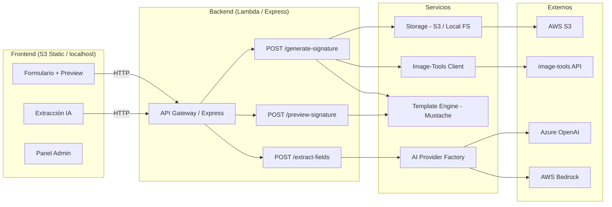

# Email Signature Generator

Aplicación web self-service para generar firmas de correo corporativas con IA. El usuario sube su foto, llena datos (manual o con IA), selecciona plantilla, personaliza el fondo y obtiene su firma HTML lista para copiar en Outlook o Gmail.

## Arquitectura



## Quick Start

```bash
# 1. Instalar dependencias
cd lambda && npm install

# 2. Configurar entorno
cd .. && cp .env.example .env

# 3. Levantar servidor
cd lambda && npm run dev
```

Abre `http://localhost:3000` — funciona sin AWS ni servicios externos.

## Funcionalidades

| # | Feature | Descripción |
|---|---------|-------------|
| 1 | Extracción con IA | Texto libre → campos del formulario (Azure OpenAI / Bedrock) |
| 2 | 3 plantillas | Corporativa (130×160px), Moderna-Banner (180×210px), Minimalista (56×56px) |
| 3 | Composición de imagen | 3 presets: centrado, inferior, avanzado (parámetros custom) |
| 4 | Fondo personalizado | Upload de fondo + recorte con Cropper.js (ratio por plantilla) |
| 5 | Recorte de foto | Recorte libre de foto de perfil (opcional) |
| 6 | Validación de imagen | Máx 15MB, solo PNG/JPG/WebP |
| 7 | Vista previa instantánea | Preview con imagen seleccionada sin esperar procesamiento |
| 8 | Generación con image-tools | Servicio externo + fallback local si no está disponible |
| 9 | Exportación múltiple | Copiar para Outlook (HTML), Copiar para Gmail, Descargar HTML, Abrir en ventana |
| 10 | Panel admin | Validador de templates (8 reglas: 4 errores, 4 warnings) |
| 11 | Autenticación admin | SHA-256 con hash configurable via env var |
| 12 | Datos de ejemplo | Botón para llenar formulario con datos de prueba |
| 13 | Feedback de fallback | Indica cuando image-tools no está disponible y se usó la imagen original |

## Variables de entorno

| Variable | Default | Requerida | Descripción |
|----------|---------|-----------|-------------|
| `APP_MODE` | `local` | Sí | `local` (mocks) o `aws` (producción) |
| `PORT` | `3000` | No | Puerto del dev server |
| `S3_BUCKET_NAME` | — | Prod | Nombre del bucket S3 para assets |
| `AWS_REGION` | `us-east-1` | Prod | Región AWS |
| `IMAGE_TOOLS_URL` | — | Opcional | URL del servicio de procesamiento de imagen |
| `IMAGE_TOOLS_API_KEY` | — | Opcional | API key para image-tools |
| `BACKGROUND_TEMPLATE_URL` | — | Opcional | URL del fondo por defecto para banners |
| `AI_PROVIDER` | `azure` | Sí | `azure` o `bedrock` |
| `AZURE_OPENAI_ENDPOINT` | — | Si azure | URL del recurso Azure OpenAI |
| `AZURE_OPENAI_KEY` | — | Si azure | API key de Azure OpenAI |
| `AZURE_OPENAI_DEPLOYMENT` | `gpt-4o-mini` | Si azure | Nombre del deployment |
| `BEDROCK_MODEL_ID` | `anthropic.claude-3-haiku-20240307-v1:0` | Si bedrock | ID del modelo |
| `BEDROCK_REGION` | `us-east-1` | Si bedrock | Región de Bedrock |
| `ADMIN_PASSWORD_HASH` | — | Opcional | Hash SHA-256 del password admin |

Para generar el hash de admin:

```bash
node scripts/generate-hash.js miPasswordSeguro123
```

## Deployment (AWS SAM)

### Pre-requisitos

- AWS CLI configurado
- AWS SAM CLI (`pip install aws-sam-cli`)
- Node.js 20.x

### Comandos

```bash
# Build
sam build

# Deploy (primera vez — interactivo)
sam deploy --guided

# Deploy (posteriores — usa samconfig.toml)
sam deploy

# Subir frontend al bucket S3
aws s3 sync frontend/ s3://<FrontendBucketName>/ --delete
```

### Recursos creados por SAM

- **SignatureApi** — HTTP API Gateway con CORS
- **GenerateSignatureFunction** — Lambda para generar firma completa
- **PreviewSignatureFunction** — Lambda para preview rápido
- **ExtractFieldsFunction** — Lambda para extracción IA
- **AssetsBucket** — S3 público para imágenes (originals + banners + backgrounds)
- **FrontendBucket** — S3 static website para el frontend

## Tests

```bash
cd lambda
npm test            # 70 tests con coverage
npm run test:watch  # Modo watch
```

Cobertura: config, validación, template engine, storage, AI provider factory y Lambda handlers.

## Estructura del proyecto

```
/
├── frontend/
│   ├── index.html              # Página principal
│   ├── admin.html              # Panel admin (validador de templates)
│   ├── css/styles.css          # Estilos custom + paleta
│   ├── js/
│   │   ├── api.js              # Cliente API (fetch)
│   │   ├── app.js              # Lógica principal del formulario
│   │   ├── auth.js             # Autenticación admin SHA-256
│   │   ├── cropper-handler.js  # Integración Cropper.js
│   │   ├── fieldConfig.js      # Config de campos + tamaños por plantilla
│   │   ├── preview.js          # Renderizado preview en iframe
│   │   └── validator.js        # Validador de templates (8 reglas)
│   └── assets/                 # Iconos SVG
├── lambda/
│   ├── src/
│   │   ├── handlers/
│   │   │   ├── generateSignature.js
│   │   │   ├── previewSignature.js
│   │   │   └── extractFields.js
│   │   ├── services/
│   │   │   ├── templateEngine.js
│   │   │   ├── storageService.js
│   │   │   └── imageToolsClient.js
│   │   ├── providers/
│   │   │   ├── aiProvider.js          # Factory
│   │   │   ├── azureOpenAIProvider.js
│   │   │   └── bedrockProvider.js
│   │   └── utils/
│   │       ├── config.js
│   │       └── validation.js
│   ├── tests/unit/             # 70 Jest tests
│   ├── dev-server.js           # Express dev server
│   ├── local-storage/          # Imágenes generadas en dev (gitignored)
│   └── package.json
├── templates/
│   ├── corporativa.mustache    # 130×160px portrait
│   ├── moderna-banner.mustache # 180×210px portrait
│   └── minimalista.mustache    # 56×56px square
├── scripts/
│   └── generate-hash.js        # Utilidad: generar SHA-256 hash
├── template.yaml               # AWS SAM (infra)
├── .env                        # Config local (gitignored)
├── .env.example                # Ejemplo de configuración
└── docs/
    ├── architecture.md         # Arquitectura y diagramas
    ├── api-reference.md        # Endpoints y ejemplos
    └── local-development.md    # Guía de desarrollo local
```

## Tecnologías

| Capa | Stack |
|------|-------|
| Frontend | HTML/JS vanilla + Tailwind CDN + Cropper.js |
| Backend | Node.js 20, Express (dev) / AWS Lambda (prod) |
| Templates | Mustache (3 diseños Outlook-compatible) |
| IA | Azure OpenAI (gpt-4o-mini) / AWS Bedrock (Claude Haiku) |
| Imágenes | image-tools externo (composición persona + fondo) |
| Storage | Filesystem local (dev) / AWS S3 (prod) |
| Infraestructura | AWS SAM (Lambda + API Gateway + S3) |
| Tests | Jest — 70 tests unitarios |

## Documentación

- [Arquitectura del sistema](docs/architecture.md)
- [Referencia de API](docs/api-reference.md)
- [Desarrollo local](docs/local-development.md)
