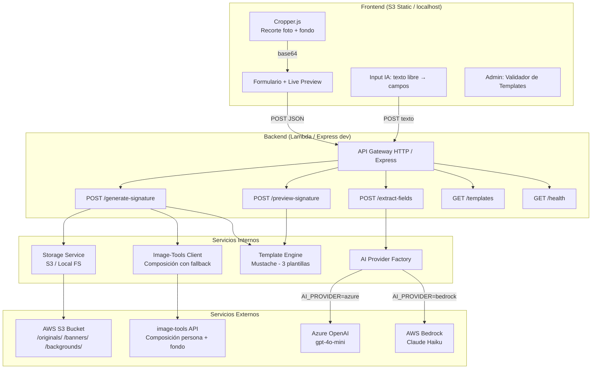
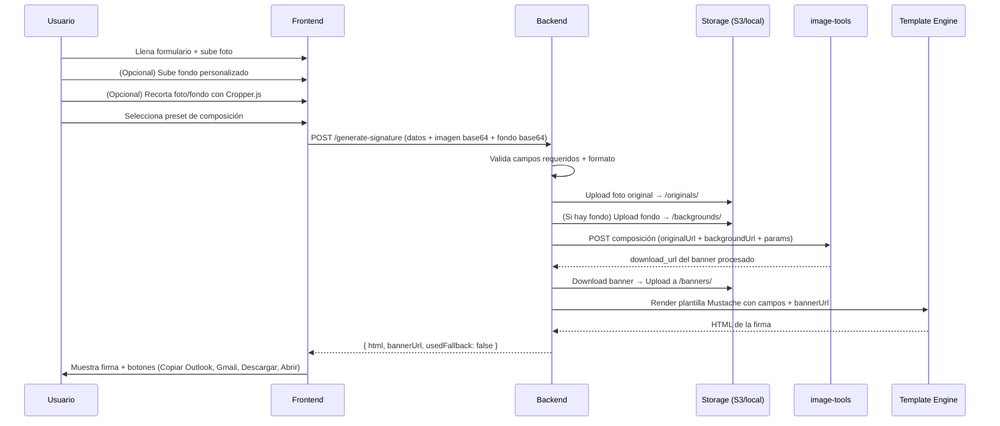
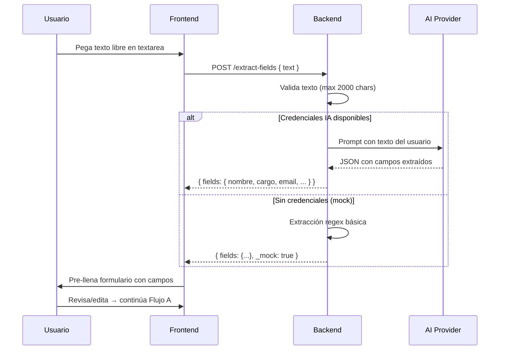
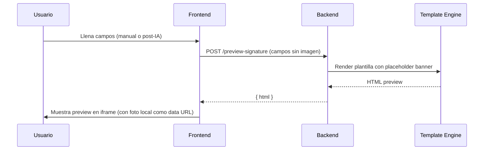

# Arquitectura

## Diagrama del sistema



## Flujos de datos

### Flujo A: Generación manual completa



### Flujo B: Extracción con IA



### Flujo C: Preview rápido



## Componentes principales

### Frontend

| Archivo | Responsabilidad |
|---------|----------------|
| `index.html` | Página principal: formulario, preview, generación |
| `admin.html` | Panel admin: login + validador de templates |
| `js/app.js` | Orquestación: form handling, AI extract, generate, copy/download |
| `js/api.js` | Cliente HTTP para todos los endpoints |
| `js/cropper-handler.js` | Cropper.js: recorte de foto de perfil y fondo personalizado |
| `js/fieldConfig.js` | Configuración de campos + tamaños de imagen por plantilla |
| `js/preview.js` | Renderizado de preview en iframe con auto-height |
| `js/auth.js` | Autenticación admin (SHA-256 client-side) |
| `js/validator.js` | Validador de templates (8 reglas: 4 errores + 4 warnings) |

### Backend

| Módulo | Responsabilidad |
|--------|----------------|
| `handlers/generateSignature.js` | Lambda: validar → upload → crear banner → render HTML |
| `handlers/previewSignature.js` | Lambda: render con placeholder sin procesar imagen |
| `handlers/extractFields.js` | Lambda: enviar a IA → parsear → retornar campos |
| `services/templateEngine.js` | Cargar y renderizar plantillas Mustache |
| `services/storageService.js` | Abstracción storage: S3 / Azure / filesystem |
| `services/imageToolsClient.js` | Cliente image-tools con fallback local |
| `providers/aiProvider.js` | Factory: selecciona provider según `AI_PROVIDER` |
| `providers/azureOpenAIProvider.js` | Implementación Azure OpenAI REST |
| `providers/bedrockProvider.js` | Implementación AWS Bedrock SDK |
| `utils/config.js` | Lectura centralizada de env vars |
| `utils/validation.js` | Validación de requests (campos, formatos, tamaños) |

### Templates Mustache

El sistema incluye 5 plantillas de firma con diferentes estilos y tamaños de imagen:

#### Templates públicas (visibles en el frontend para todos los usuarios)

| Plantilla | Tamaño imagen | Descripción |
|-----------|---------------|-------------|
| `corporativa` | 130×160px | Portrait clásico, diseño conservador con paleta gris/azul |
| `moderna-banner` | 180×210px | Portrait grande, diseño con banner destacado e iconos sociales |
| `minimalista` | 56×56px | Foto cuadrada pequeña, diseño limpio y compacto |

#### Templates privadas (directorio `/lambda/templates/private/`)

| Plantilla | Tamaño imagen | Descripción |
|-----------|---------------|-------------|
| `signature-business` | 162×162px | Foto cuadrada, branding destacado, acento verde, iconos LinkedIn/X |
| `signature-company` | 240×184px | Foto grande con fondo degradado, esquinas redondeadas, iconos LinkedIn/X |

**Características especiales de templates privadas:**
- Configuración personalizada via `config.json` (storage FTP/SFTP propio, título HTML custom, esquinas redondeadas)
- Campos específicos del cliente (`firstname`, `lastname`, `positionOriginal`, etc.)
- No aparecen en el selector público del frontend (requieren URL directa o integración custom)
- Credenciales FTP se configuran en `.env` siguiendo el patrón `FTP_<ID_MAYUS>_USER` / `FTP_<ID_MAYUS>_PASSWORD`

Ver [`docs/local-development.md`](../docs/local-development.md) → "Storage personalizado por plantilla" para detalles sobre cómo configurar storage FTP/SFTP.

### Image-Tools Client

El servicio `imageToolsClient.js` maneja la composición de persona sobre fondo:

- **Modo producción (aws):** Llama al servicio externo siempre
- **Modo local:** Intenta el servicio real si `IMAGE_TOOLS_URL` está configurado; si falla o no existe, copia la imagen original como banner (fallback)
- **Parámetros de composición:** `scalePercent`, `horizontalAlign`, `verticalAlign`, `paddingPercent`, `offsetX`, `offsetY`, `cornerRadiusPercent` (para esquinas redondeadas)
- **Respuesta incluye:** `{ url, usedFallback, fallbackReason }` para que el frontend informe al usuario

**Presets de composición disponibles en el formulario:**

| Preset | `scalePercent` | `horizontalAlign` | `verticalAlign` | `paddingPercent` | Uso típico |
|--------|----------------|-------------------|------------------|-------------------|------------|
| Centrado | 100 | `center` | `center` | 0 | Foto ocupa todo el espacio, centrada |
| Inferior (75%) | 75 | `center` | `bottom` | 0 | Persona al 75% del tamaño, alineada abajo-centro |
| Avanzado (manual) | Custom | Custom | Custom | Custom | Control total de todos los parámetros |

El modo "Avanzado" del formulario permite ajustar manualmente todos estos valores, útil para afinar la composición después de probar un preset.

## Modo local vs producción

| Componente | Local (`STORAGE_PROVIDER=local`, default) | Producción (`STORAGE_PROVIDER=s3` o `azure`) |
|------------|--------------------------------------------|-----------------------------------------------|
| Servidor | Express en localhost:3005 | Lambda + API Gateway HTTP |
| Storage | Filesystem `lambda/local-storage/` | S3 bucket público o Azure Storage container |
| URLs de imagen | `http://localhost:3005/storage/...` | `https://<bucket>.s3.amazonaws.com/...` o `https://<account>.blob.core.windows.net/...` |
| Image-tools | Intenta real si configurado → fallback copia original | Llama API externa (error si falla) |
| AI Provider | Azure OpenAI real (si hay creds) / Mock regex | Bedrock o Azure según config |
| Frontend hosting | Servido por Express estático | S3 Static Website |
| Autenticación admin | SHA-256 client-side (misma lógica) | SHA-256 client-side (misma lógica) |

## Patrón Provider (IA)

```
aiProvider.js (factory → getAIProvider())
├── azureOpenAIProvider.js  → Azure OpenAI REST API (gpt-4o-mini)
└── bedrockProvider.js      → AWS SDK v3 InvokeModel (Claude Haiku)
```

Selección via `AI_PROVIDER` env var. Ambos implementan `callModel(prompt) → string`.

Si no hay credenciales configuradas en modo local, el endpoint `/extract-fields` retorna una extracción regex básica con flag `_mock: true`.

## Seguridad

- **Admin:** Autenticación SHA-256 client-side comparando hash ingresado vs `ADMIN_PASSWORD_HASH`
- **CORS:** Habilitado globalmente (`Access-Control-Allow-Origin: *`)
- **Validación:** Todos los inputs validados server-side (campos requeridos, formato email, tamaño imagen ≤ 15MB, tipos permitidos)
- **API Keys:** `IMAGE_TOOLS_API_KEY` se envía como header `X-API-KEY`

## Infraestructura AWS (SAM)

El archivo `template_aws.yml` define:

- 1 HTTP API Gateway con CORS
- 3 Lambda functions (Node.js 20, 512MB RAM, 60s timeout)
- 1 S3 bucket para assets (acceso público lectura)
- 1 S3 bucket para frontend (static website)
- IAM roles con permisos mínimos (S3 PutObject, Bedrock InvokeModel)
