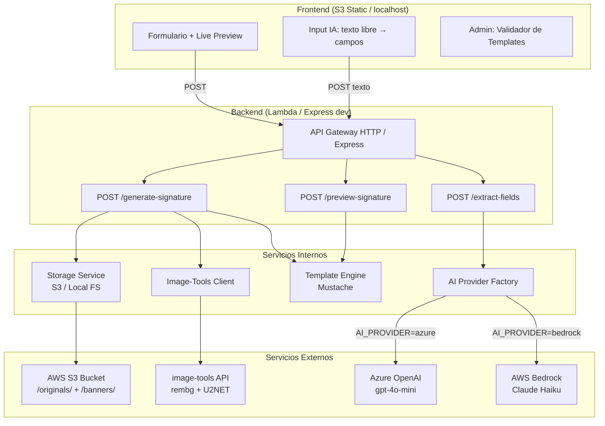

# Arquitectura

## Diagrama general



## Flujos de datos

### Flujo A: Generación manual
1. Usuario llena formulario + sube foto
2. Frontend envía POST `/generate-signature` con datos + imagen base64
3. Lambda: valida → sube original a S3 → llama image-tools → sube banner a S3 → compila HTML
4. Respuesta: `{ html, bannerUrl }`
5. Frontend muestra firma y permite copiar/descargar

### Flujo B: Generación con IA
1. Usuario pega texto libre ("Jonathan Arana, jonathan@contoso.com, Tech Lead...")
2. Frontend envía POST `/extract-fields` con el texto
3. Lambda: envía prompt a AI provider → parsea JSON → retorna campos
4. Frontend pre-llena el formulario → usuario revisa → sube foto → continúa Flujo A

### Flujo C: Preview rápido
1. Usuario llena campos (manual o IA) sin subir foto
2. Frontend envía POST `/preview-signature`
3. Lambda: renderiza template con placeholder banner → retorna HTML
4. Frontend muestra preview inmediato

## Modo local vs producción

| Componente | Local (APP_MODE=local) | Producción (APP_MODE=aws) |
|------------|------------------------|---------------------------|
| Server | Express en localhost:3000 | Lambda + API Gateway |
| Storage | Filesystem `lambda/local-storage/` | S3 bucket público |
| Image-tools | Intenta servicio real si `IMAGE_TOOLS_URL` configurado; fallback copia original | Llama API externa real |
| AI | Azure OpenAI real (si hay credenciales) / Mock regex | Bedrock / Azure OpenAI |
| Frontend | Servido por Express | S3 Static Website |
| Preview | Usa data URL de imagen seleccionada (cliente) | Usa data URL de imagen seleccionada (cliente) |

## Patrón Provider (IA)

```
aiProvider.js (factory)
├── azureOpenAIProvider.js  → Azure OpenAI REST API
└── bedrockProvider.js      → AWS SDK v3 InvokeModel
```

Se selecciona via `AI_PROVIDER` env var. Ambos implementan `callModel(prompt) → string`.
